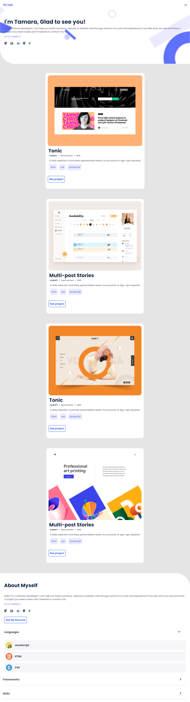

# Portfolio

> This a personal portfolio project designed using figma template for good user interface design

# WORKFLOW SCREENSHOT


## Built With
- HTML
- CSS
- Figma Tempalate
## Live Demo (if available)

[Live Demo Link](https://siansandatamara.github.io/-the-Portfolio/
)

## Getting Started

To get a local copy up and running follow these simple example steps.

### Prerequisites

- Web Browser
- Code Editor
- Figma Template
- Prior knowledge of CSS, HTML, GIT, GITHUB and Linters.

### Setup

```bash
git clone https://github.com/SiansandaTamara/the-Portfolio
cd Portfolio
```

### Usage

Open the index file of the project in the browser to see the project

## Authors

👤 **Tamara Siansanda**

- GitHub: [@SiansandaTamara](https://github.com/SiansandaTamara)
- Twitter: [@twitterhandle](https://twitter.com/TamaraSiansanda)

## 🤝 Contributing

Contributions, issues, and feature requests are welcome!

Feel free to check the [issues page](../../issues/).

## Show your support

Give a ⭐️ if you like this project!

## Acknowledgments

- Hat tip to anyone whose code was used
- Inspiration
- etc

## 📝 License

This project is [MIT](./MIT.md) licensed.
